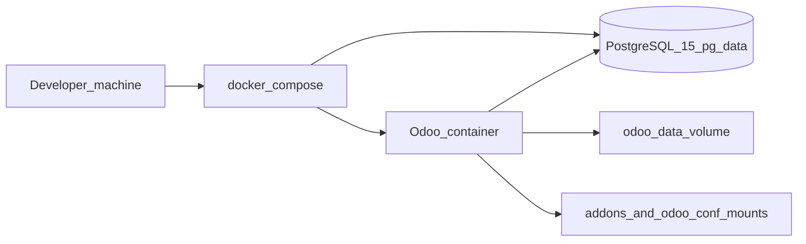

# Odoo Docker

This repository deploys **Odoo in Docker** for local development and similar environments. A PostgreSQL 15 database and an Odoo application container are orchestrated with Docker Compose. Odoo’s framework source is expected under `odoo/` (obtained separately from this repo); custom modules live under `addons/`.

For deeper setup steps, architecture detail, and feature documentation, see **[docs/README.md](docs/README.md)**.

## Architecture (brief)

Compose runs two services: **`db`** (Postgres with a named volume and a health check) and **`odoo`** (image built from this repo’s `Dockerfile`). The Odoo service waits until the database is healthy, exposes **8069** (HTTP) and **8072** (longpolling), persists filestore in a volume, and bind-mounts `./addons` and `./config/odoo.conf`. The image bakes in your local `odoo/` tree at build time.



## Repository layout

| Path | Role |
|------|------|
| `odoo/` | Odoo source checkout (not tracked here; see `.gitignore`). Required before `docker compose build`. |
| `addons/` | Extra addons mounted at `/mnt/extra-addons` (for example `apps_pins`). |
| `config/odoo.conf` | Odoo server config (mounted read-only). Must match database settings used by Compose. |
| `Dockerfile` / `docker-entrypoint.sh` | Image build and runtime user (`odoo` via `gosu`). |
| `docker-compose.yml` | `db` + `odoo` services, ports, volumes. |
| `.example.env` | Template for `.env` (database name, user, password). Copy to `.env` and customize. |

## Quick start

Run the following from a shell. If you already cloned this repo, start at the `cd` step and skip the first `git clone`.

```bash
# 1. Clone this repository (replace the URL with yours)
git clone <YOUR_REPO_GIT_URL> odoo-docker
cd odoo-docker

# 2. Clone Odoo into ./odoo (branch must match the version you run, e.g. 19.0)
git clone --depth 1 --branch 19.0 https://github.com/odoo/odoo.git odoo

# 3. Create local env from template, then set a strong POSTGRES_PASSWORD (and user/db if you change them)
cp .example.env .env
${EDITOR:-nano} .env

# 4. Edit Odoo config: db_host=db, db_user/db_password must match POSTGRES_USER/POSTGRES_PASSWORD in .env
${EDITOR:-nano} config/odoo.conf

# 5. Build image (bakes in ./odoo) and start Postgres + Odoo
docker compose build
docker compose up -d

# 6. Optional: follow logs until Odoo is ready
docker compose logs -f odoo
```

Then open **http://localhost:8069** in a browser, create a database (or use an existing one), and install optional custom modules such as **Apps Pins** from **Apps** if you need that feature.

**Note:** Compose’s `env_file` does **not** rewrite `config/odoo.conf`. `db_user` and `db_password` there must match `.env` manually. For more detail and troubleshooting, see [docs/installation.md](docs/installation.md).

## Operations

- **Logs:** `docker compose logs -f odoo` (or `db`).
- **Stop:** `docker compose down` (add `-v` only if you intend to remove named volumes and data).
- **Upgrade a custom module** (example `apps_pins`, replace `YOUR_DB`):

  ```bash
  docker compose exec odoo python odoo-bin -c /etc/odoo/odoo.conf -d YOUR_DB -u apps_pins --stop-after-init
  ```

  Then restart the Odoo service if needed: `docker compose restart odoo`.

## Current stack and capabilities

There is no project changelog in git yet; this section describes what this repo provides today:

- **PostgreSQL 15** with a health check so Odoo starts only after the database accepts connections.
- **Sample production-oriented options** in `odoo.conf` (workers, memory limits, `proxy_mode`, logging).
- **Custom module `apps_pins`** (Odoo 19): pinned apps behavior and related UI; documented under [docs/features/apps-pins.md](docs/features/apps-pins.md).
- **Safety defaults in git:** `.env` and `odoo/` are ignored so secrets and upstream source are not committed by mistake.

Once you start versioning with commits, you can maintain a human-readable history in **`docs/CHANGELOG.md`** (optional).

## Documentation

- **[docs/README.md](docs/README.md)** — Documentation index (installation, architecture, features, assets).
