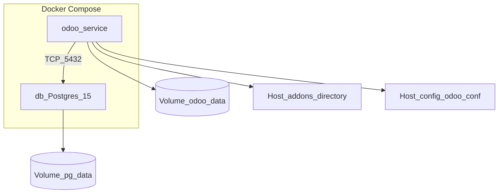

# Architecture

This document describes how the Docker deployment is wired: services, storage, and where Odoo loads code from.

## High-level diagram



## Services

### `db`

- **Image:** `postgres:15`.
- **Configuration:** Reads `POSTGRES_*` from `.env` via `env_file`.
- **Data:** Named volume `pg-data` mounted at `/var/lib/postgresql/data`.
- **Health:** `pg_isready` so dependent services start only when Postgres accepts connections.

### `odoo`

- **Image:** Built from the repository `Dockerfile` (Python 3.11, system libraries, Odoo requirements).
- **Source in image:** Local `odoo/` is copied to `/opt/odoo/odoo` at **build** time. Rebuild the image when you change framework code in that tree.
- **Runtime user:** `docker-entrypoint.sh` fixes ownership of `/var/lib/odoo` then runs `odoo-bin` as the `odoo` user (`gosu`).
- **Ports:** `8069` (HTTP), `8072` (longpolling).
- **Mounts:**
  - `odoo-data` → `/var/lib/odoo` (filestore and related data under `data_dir`).
  - `./addons` → `/mnt/extra-addons` (custom modules; editable without rebuild).
  - `./config/odoo.conf` → `/etc/odoo/odoo.conf` (read-only).

## Addon paths

`config/odoo.conf` sets:

```ini
addons_path = /opt/odoo/odoo/addons,/mnt/extra-addons
```

- **`/opt/odoo/odoo/addons`** — Standard Odoo addons shipped with the source copied into the image.
- **`/mnt/extra-addons`** — Your repository’s `addons/` directory (custom modules such as `apps_pins`).

## Configuration and secrets

- **Postgres credentials** for the `db` container come from `.env`.
- **Odoo’s connection** to that database is defined in `config/odoo.conf`. Those values must match the Postgres service configuration.

## Related reading

- [installation.md](installation.md) — Step-by-step setup.
- [features/apps-pins.md](features/apps-pins.md) — Custom module behavior.
